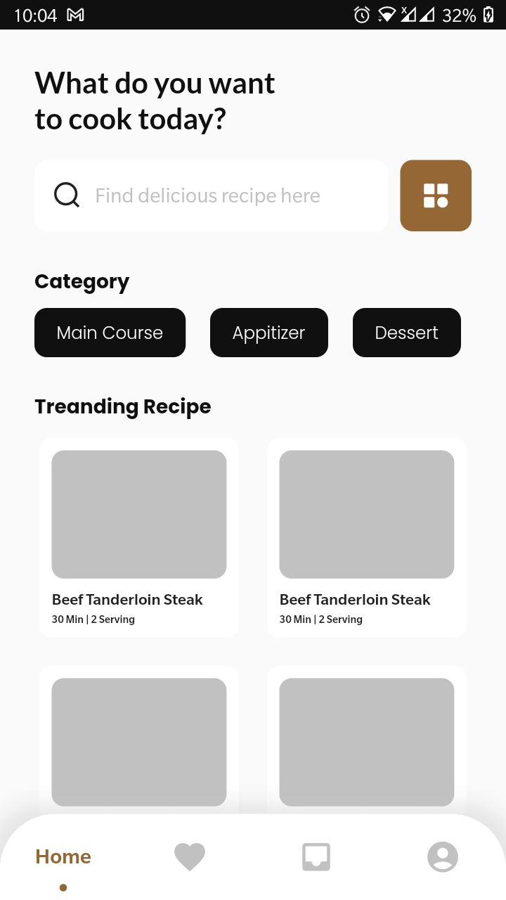
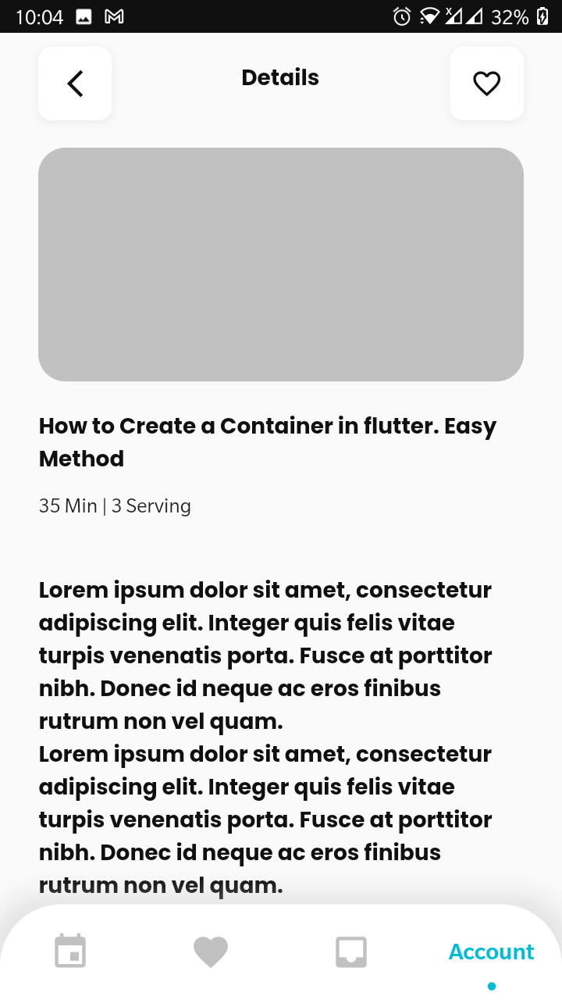

# Flutter Recipe App UI

This is a Flutter application that provides a user interface for a recipe app. The app allows users to browse through different categories of recipes, search for specific recipes, and view details about each recipe.

## Screenshots

## Features

- Browse through different categories of recipes
- Search for specific recipes
- View details about each recipe
- Save favorite recipes for easy access
- Responsive design for different screen sizes

## Getting Started

1. Clone this repository
2. Open the project in your preferred IDE (e.g. Android Studio, Visual Studio Code)
3. Install the necessary dependencies by running `flutter pub get`
4. Run the app on an emulator or physical device by running `flutter run`

## Dependencies

- [flutter_svg](https://pub.dev/packages/flutter_svg) for displaying SVG images

## 🔗 Follow

